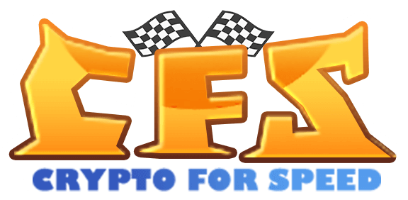

# CryptoForSpeed DOCs

<!--  -->

## 
How to get Auto cards?

1. Participate in pre-sale. Players will qualify for participating in pre-sale by completing the whitelist task and earn enough entries. You can draw 1 auto card by investing 0.5BNB in Pre-sale（these will be covered later）. Each user who get the pre-sale qualification can draw up to 4 auto cards（2 BNB）. Each time a player draws a NFT auto card, he will get the LP token (0.25BNB and 7500CFS) CFS-BNB-LP with the initial value of 0.5bnb. The LP token can be Unstake after 60 days, noted the auto card will not disappear; A total of 2000 NFT auto cards are distributed totally through pre-sale.

2. You can draw car cards in the game as well. Firstly, you need to get LP tokens(CFS-BNB-LP) by stake LP with a value of 0.5bnb in the pancake, then you can draw auto cards once by stake LP in the CryptoForSpeed; Noted: The LP token can be Unstake after 60 days, and the auto card will not disappear. (You can tap the Unstake after 60days then get your LP released.)

3. Use CFS to buy others' auto cards in the Market. In the Market transaction, but the buyer can only get the NFT auto cards and will not get the LP token that used to get it before at the same time.
